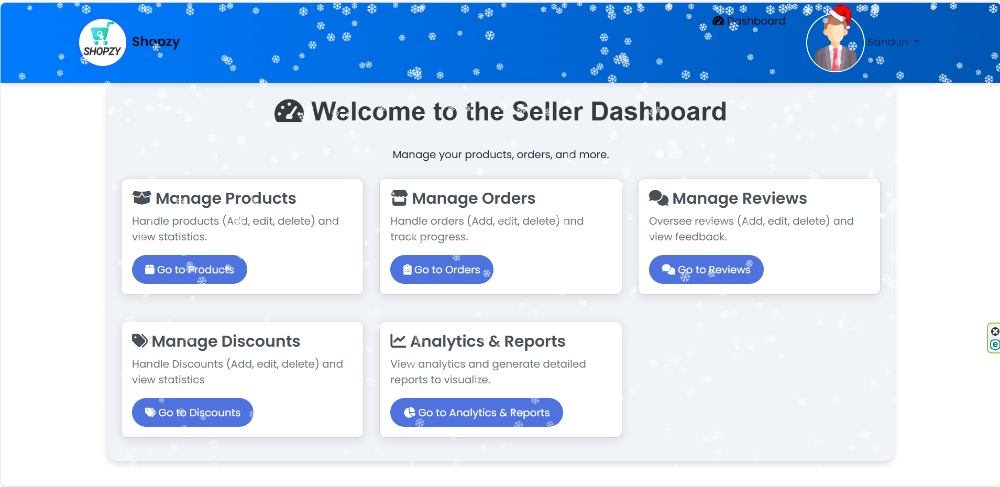
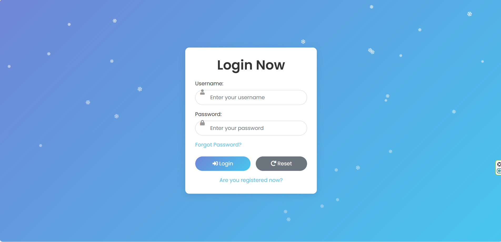
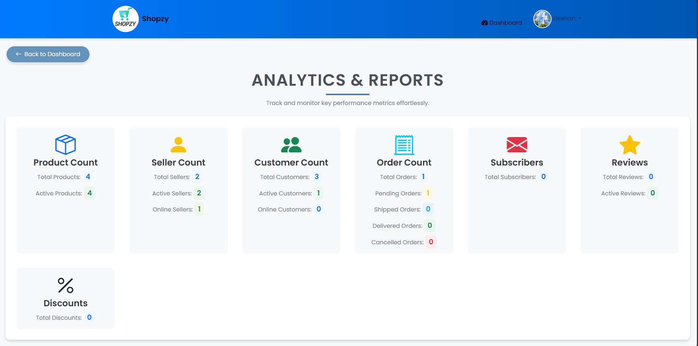

# 🛍️ E-Commerce Platform  

📌 **Overview**  
Welcome to the **E-Commerce Platform** repository! This project is a fully functional e-commerce website designed to provide a seamless shopping experience for customers, efficient product management for sellers, and comprehensive administrative control for admins. Built using **HTML, CSS, JavaScript, PHP, and MySQL**, this platform is a robust solution for online shopping and management.  

---

## ✨ **Features**  

### 1. **Home Page**  
- **Search Product**: Users can search for products using keywords, categories, or filters.  
- **Display Trending/New Products**: Showcase popular, trending, or recently added items.  
- **Product Discounts**: Highlight ongoing discounts, special deals, or promotions.  
- **Sale Announcements/News**: Display seasonal sales, new collections, or website updates.  
- **Customer Testimonials**: Show reviews from happy customers to boost trust.  
- **Newsletter Subscription**: Users can subscribe for offers, discounts, and product launch updates.  

### 2. **Product Pages**  
- **Product Listing**: Displays all products with sorting/filter options (by price, category, rating, etc.).  
- **Detailed Product Information**: Includes product description, specifications, available sizes/colors, stock availability, etc.  
- **Product Images & Videos**: High-quality images, zoom options, and product demo videos.  
- **Product Reviews**: User-generated reviews with ratings, comments, and possibly photos.  
- **Add to Cart Options**: Button to add items to the cart, with a quantity selector.  
- **Shipping Information**: Display shipping options, costs, and estimated delivery dates.  

### 3. **Cart Section**  
- **Cart Overview**: Displays items in the cart with product names, prices, and quantities.  
- **Update Product Quantity**: Customers can increase or decrease the number of items.  
- **Calculate Cart Total**: Automatically calculates the total price, including taxes, shipping, and any discounts.  
- **Apply Discount Codes**: Option to add promotional codes or vouchers for discounts.  
- **Shipping and Payment Options**: Choose shipping methods and preferred payment options (credit/debit cards, PayPal, etc.).  
- **Proceed to Checkout**: Allows customers to complete their purchases with a streamlined checkout process.  

### 4. **Customer Section**  
- **Login/Register**: Allows customers to sign in or create a new account.  
- **Profile Management**: Customers can update or delete their profiles, change personal information, and manage preferences.  
- **Change Password**: Option to update passwords, with additional security measures.  
- **View Order History**: Customers can track past orders, view order status, and reorder.  
- **Manage Cart**: Customers can view and modify their cart items, update product quantities, or remove items.  
- **Order Tracking**: Real-time tracking of shipping and delivery status.  
- **Product Returns**: Request returns or exchanges for purchased items.  
- **Reply to Seller**: Customers can send messages to sellers regarding their orders.  
- **Admin Contact Support**: Provide feedback or queries through forms, email, or phone.  

### 5. **Seller Section**  
- **Login/Register**: Sellers can sign in or register as a new seller.  
- **Profile Management**: Sellers can update or delete their profiles and business information.  
- **Change Password**: Option to update their login credentials.  
- **Add, Update, or Delete Products**: Sellers can manage their product listings, including product details, images, and prices.  
- **View and Manage Orders**: Access to current and past orders, along with order status updates.  
- **Reply to Customer Inquiries**: Sellers can respond to customer questions or issues regarding products.  
- **Manage Product Reviews**: Sellers can view and respond to customer reviews.  
- **Sales Analytics**: Overview of sales, earnings, product performance, and customer feedback.  
- **Contact Admin**: Sellers can reach out to the site admin for support or inquiries.  

### 6. **Admin Section**  
- **Login/Register**: Admins can securely sign in or register.  
- **Profile Management**: Admins can update or delete their profiles.  
- **Change Password**: Admins can update their login credentials.  
- **Manage Customers**: Full access to customer profiles, with the ability to modify or delete accounts and manage access controls.  
- **View and Reply to Customer Comments**: Admins can see customer feedback and respond accordingly.  
- **Manage Sellers**: Full access to seller profiles, with options to edit, delete, or manage their access.  
- **View and Reply to Seller Comments**: Admins can review seller feedback and reply if needed.  
- **Manage Orders**: Oversee all orders, resolve disputes, and update order statuses.  
- **Manage Products**: Add, update, or remove products from the store, manage categories, and oversee inventory.  
- **Approve/Disapprove Seller Products**: Admins can review and approve products added by sellers before they are live.  
- **Manage Reviews**: Admins can moderate, approve, or delete customer reviews for products.  
- **Analytics and Reports**: Access detailed reports on sales, traffic, customer activity, and more to help with decision-making.  

---

## 🛠️ **Technologies Used**  
- **Frontend**: HTML, CSS, JavaScript  
- **Backend**: PHP  
- **Database**: MySQL  

---

## 📸 **Screenshots**  
Here are some screenshots of the application in action:  

| **Home Page** | **Dashboard** | **Admin Login** | **Analytics** |  
|---------------|---------------|-----------------|---------------|  
|  |  |  |  |  

---

## 🚀 **Getting Started**  

### Prerequisites  
- **PHP** installed on your machine.  
- **MySQL** database set up.  
- A web server (e.g., Apache, Nginx).  

### Installation  
1. **Clone the repository**:  
   ```bash
   git clone https://github.com/deshanJagoda/E-Commerce_WebSite-PHP.git
